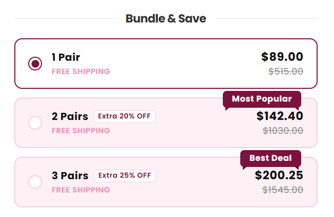

# Shopify Bundle & Save — Custom Quantity Discount Block

A **free, self-hosted alternative** to paid "Bundle & Save" / volume-discount Shopify apps.
Built with pure Liquid + vanilla JavaScript — no app subscription, no revenue-based pricing tiers, no monthly fee that grows with your store.



## Why this exists

The store I built this for was using a third-party "Bundle & Save" app to show quantity-based
discount options (Buy 1 / Buy 2 / Buy 3) on the product page. It worked fine — until the store's
sales crossed the app's first revenue tier. At that point:

- The bundle blocks were **automatically removed** from the storefront.
- The app demanded a **plan upgrade** to keep working.
- This wasn't a one-time thing — every time the store's sales grew past the next tier, the app
  asked for another upgrade.

Since the pricing scaled with the store's success (not with actual feature usage), the store was
effectively paying more every month just for *growing*. So instead of continuing to rent this
functionality, I rebuilt it as a **custom Liquid block** that:

- Costs **$0/month**, forever, regardless of sales volume.
- Lives directly inside the theme code — no external app dependency, no risk of losing it if
  an app gets removed/suspended/deprecated.
- Matches the original app's UI/UX pixel-for-pixel (same layout, same badges, same interaction).

## What it does

- Renders 3 selectable "bundle" options (1 / 2 / 3 items) on the product page, each with its own
  discounted price preview and a "Most Popular" / "Best Deal" badge.
- Lets the customer pick a quantity visually, without touching Shopify's native variant/quantity
  inputs.
- On "Add to Cart", adds the **correct quantity** to the cart via the Ajax Cart API
  (`/cart/add.js`) — regardless of how the merchant's theme blocks are ordered on the page.
- Plays correctly with the store's **"Skip cart" (direct-to-checkout)** setting, so the customer
  is redirected to `/checkout` with the right quantity instead of the default quantity of 1.
- The actual discount amount is calculated by Shopify's native
  **[Automatic Discounts](https://help.shopify.com/en/manual/discounts/discount-types)**
  engine (not faked client-side), so totals shown at checkout are always accurate and
  tax/currency-correct.

## Tech stack

- **Liquid** (Shopify's templating language) — renders the block markup and reads
  theme/section/block settings.
- **Vanilla JavaScript (ES5-compatible)** — no build step, no dependencies, no framework. Runs
  safely inside any Shopify theme.
- **Shopify Ajax Cart API** (`/cart/add.js`) — for adding items to the cart without a full page
  reload.
- **Shopify Automatic Discounts** (Admin-side, no code) — for applying the actual percentage
  discount at checkout.

## How it works (technical breakdown)

### 1. The UI (`snippets/bundle-save.liquid`)
Renders three `div[role="radio"]` options. Prices shown per option are computed client-side
(`basePrice * qty * (1 - discount)`) purely for **display purposes** — this is what makes the
component fast and app-independent, since there's no server round-trip needed just to preview a
price.

### 2. Selecting a bundle
A small JS module toggles the `.bundle-option--active` class and stores the chosen quantity on
the container element (`container.bundleSelectedQty`). This does **not** touch any native Shopify
form input — it's a fully separate, self-contained piece of state.

### 3. Add to Cart interception
This was the trickiest part. Two real-world constraints had to be solved:

- **Block order dependency**: Shopify renders theme blocks in whatever order the merchant placed
  them in the theme editor. If "Bundle & Save" renders *before* "Buy Buttons" in the DOM, a script
  that looks for the Add to Cart button on page load (`document.getElementById(...)`) will get
  `null`, because the button doesn't exist yet at that point in the parse. The fix: bind the
  interceptor on `document` itself using **event delegation with the capture phase**, so it works
  correctly no matter which block renders first.

  ```js
  document.addEventListener('click', function (e) {
    var btn = e.target.closest('#ProductSubmitButton-{{ section.id }}, [name="add"].product-form__submit');
    if (!btn) return;
    var pf = document.getElementById('product-form-{{ section.id }}');
    if (!pf || !pf.contains(btn)) return;
    e.preventDefault();
    e.stopImmediatePropagation();
    bundleAddToCart();
  }, true);
  ```

- **"Skip cart" (direct checkout) compatibility**: Many themes offer a "Skip cart" toggle that
  redirects customers straight to `/checkout` after Add to Cart. The theme's native JS reads a
  `data-skip-cart` attribute and does this redirect *using whatever quantity was submitted* — which,
  without this fix, was always `1`, since the bundle selection lived outside the native form. The
  final version calls `/cart/add.js` with the **correct** quantity first, and only then redirects
  to `/checkout` — preserving the merchant's intended UX while fixing the quantity bug.

### 4. Discounts
The component intentionally does **not** try to fake a discounted price on the cart/checkout side.
Client-side price manipulation of cart totals is (rightly) not something Shopify allows, and faking
it would create mismatches between what's shown and what's charged. Instead, the actual discount is
configured once in **Shopify Admin → Discounts → Automatic discount**, with a `Minimum quantity of
items` requirement matching each bundle tier (2+ → 20% off, 3+ → 25% off). Shopify's discount
engine automatically applies the highest eligible tier and displays it clearly at checkout.

See [`docs/discount-setup.md`](docs/discount-setup.md) for the exact Admin configuration steps.

## Installation

1. Copy [`snippets/bundle-save.liquid`](snippets/bundle-save.liquid) into your theme's `snippets/` folder.
2. In `sections/main-product.liquid`, register a new block type (or reuse an existing custom block
   slot) and render the snippet:
   ```liquid
   
     
   ```
3. Add the block to your product page from the Theme Editor.
4. Tag any product you want the bundle to appear on with `show-bundle` (the snippet only renders
   for tagged products — see the guard clause at the top of the file).
5. Set up the matching **Automatic Discounts** in Shopify Admin (see
   [`docs/discount-setup.md`](docs/discount-setup.md)).

## Known limitations

- Currently hard-coded for 3 tiers (1 / 2 / 3 units) with fixed discount percentages defined in
  the Liquid markup. Making this fully merchant-configurable via block settings (like a proper
  Shopify app would) is the natural next step — see [Roadmap](#roadmap).
- Discount percentages shown in the UI must be kept in sync manually with the Automatic Discount
  rules configured in Admin, since the two aren't currently linked programmatically.

## Roadmap

- [ ] Move discount percentages, tier count, and labels into `` block settings so
      merchants can configure everything from the Theme Editor (no code edits needed).
- [ ] Auto-generate/update the matching Shopify Automatic Discounts via the Admin GraphQL API
      when settings change, so the JS-displayed price and the real discount can never drift apart.
- [ ] Add unit variant support (currently assumes the product has no variants beyond quantity).

## License

MIT — see [LICENSE](LICENSE). Free to use, modify, and adapt for your own store or client work.

## Author

Built by Ahmed Sayed as a client project — replacing a paid, revenue-tiered Shopify app with
permanent, in-theme custom code.
